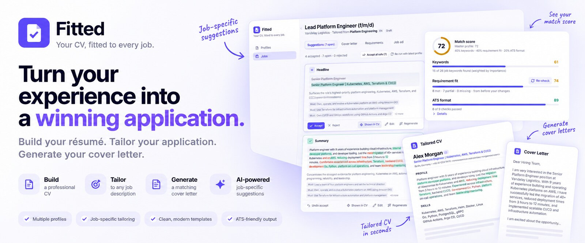
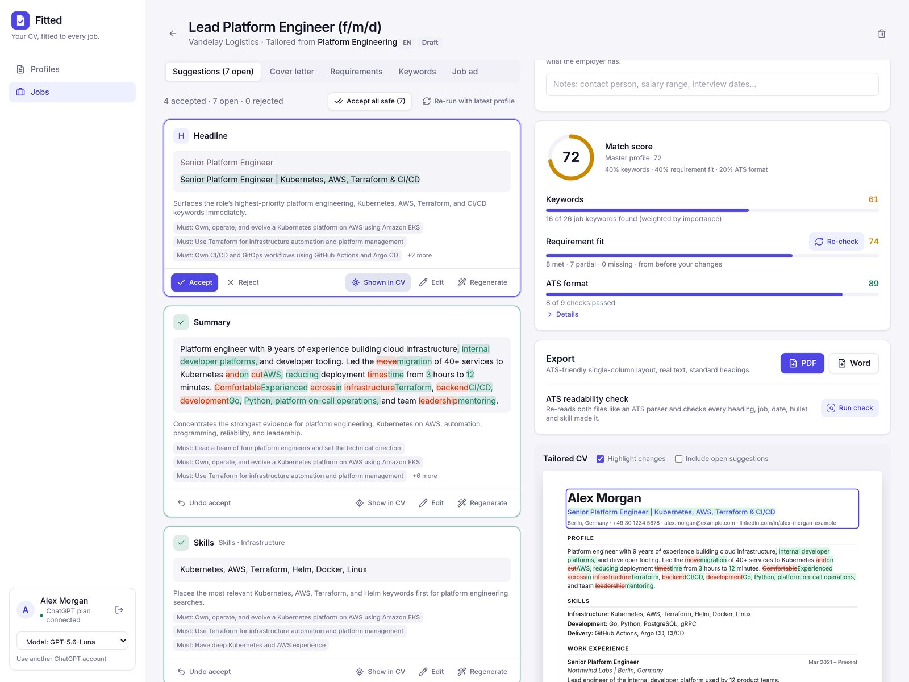
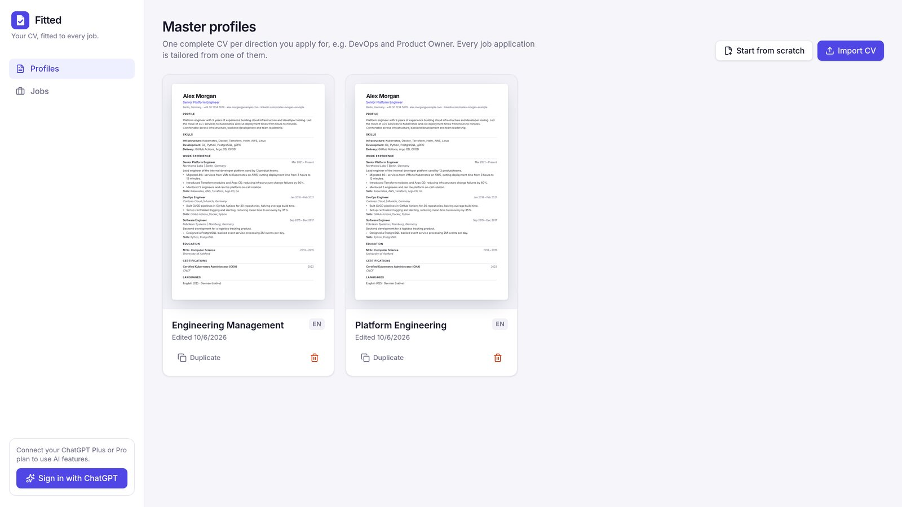
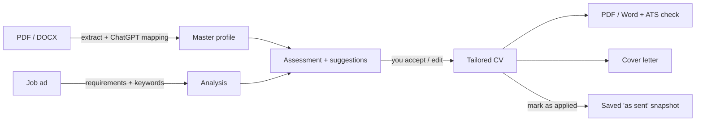

<p align="center">
  
</p>

<p align="center">
  <b>Tailor an ATS-ready CV to every job ad, with your ChatGPT subscription.</b><br>
  No API key, no per-token billing. Runs locally on your machine.
</p>

<p align="center">
  <a href="#quick-start">Quick start</a> ·
  <a href="#features">Features</a> ·
  <a href="#sign-in-with-chatgpt">Sign in with ChatGPT</a> ·
  <a href="#how-it-works">How it works</a> ·
  <a href="#development">Development</a>
</p>

---

## Why Fitted?

Most CV tools want either a monthly subscription or an OpenAI API key that bills per token. **Fitted uses the official [Sign in with ChatGPT](https://developers.openai.com/siwc/token-sharing-open-source)** flow: you log in with the ChatGPT Plus or Pro plan you already pay for, and Fitted runs its AI requests on that plan.

You keep one or more master CVs. For each job ad, Fitted scores the match and suggests concrete edits, which you review one by one in a visual diff. It also writes a matching cover letter and exports a clean, ATS-friendly PDF or Word file. It never invents experience: anything your CV doesn't back up is flagged before you accept it.

<p align="center">
  
</p>

## Features

### 🔐 Sign in with ChatGPT
- One click: OAuth 2.0 + PKCE with ChatGPT, no API key to paste
- AI usage counts against your ChatGPT plan, and you can set a weekly cap for Fitted in ChatGPT's settings
- Pick the model, e.g. a smaller, faster one for everyday tailoring

### 📄 Master profiles
- Several master CVs for different directions (e.g. *Platform Engineering* and *Engineering Management*), each in its own language (English or German)
- **Import** an existing CV from PDF or Word: ChatGPT maps it into sections, and you review the result side by side with the original text
- Flexible structure: work experience, education, skills, languages, certifications, projects and fully custom sections. Entries mix paragraphs and bullet points in any order
- Live A4 preview whose page breaks match the PDF export exactly

### 🎯 Job matching
- Paste a job ad and pick a profile: Fitted extracts the requirements and ATS keywords. This works across languages too, e.g. a German ad against an English CV
- **Match score** made of keyword coverage, requirement fit (assessed by ChatGPT) and ATS format checks. It updates live as you accept changes
- **Suggestion cards** show a word-level diff, the score impact and the requirements each change addresses. Accept, reject, edit, or regenerate with your own instruction ("keep the metric", "shorter")
- **Show in CV** highlights exactly where a change lands in the preview
- **Add to CV**: pick a missing requirement or keyword, say what's true ("set up Grafana dashboards at …"), and get a suggestion placed in the right entry
- **Truth guard**: suggestions that bring in keywords, numbers or skills missing from your profile get a warning, and "Accept all safe" skips them

### ✉️ Cover letters & applications
- Cover letters written from your tailored CV and the job ad, in your profile's language, using only facts from your CV
- Track each application through *Draft → Applied → Interview → Offer / Rejected*, with notes and a dated history
- Marking a job as applied saves the exact CV and cover letter you sent, so you can download them again later

### 📤 ATS-ready export
- **PDF** rendered by headless Chromium with the same layout as the preview: real, selectable text, embedded static fonts, no ligatures
- **Word** with real heading styles and bullet lists, single column, no tables or text boxes
- **ATS readability check**: re-extracts the text from both files the way a parser does, and verifies that every heading, job, date, bullet and skill made it, in the right order

<p align="center">
  
</p>

## Quick start

You need [Docker](https://docs.docker.com/get-docker/) and a **ChatGPT Plus or Pro** subscription.

```sh
git clone https://github.com/cutamar/fitted.git
cd fitted
docker compose up -d --build
```

Open **http://127.0.0.1:8787**, click **Sign in with ChatGPT**, and import your CV.

> [!IMPORTANT]
> Use `127.0.0.1`, not `localhost`: ChatGPT's sign-in only redirects back to `http://127.0.0.1:<port>/callback`.

| | |
|---|---|
| Different port | `PORT=9000 docker compose up -d`, then open `http://127.0.0.1:9000` |
| Your data | Docker volume `resume-data`: SQLite database and ChatGPT tokens, readable only by the app's user |
| Reset everything | `docker compose down -v` |
| Image size | ~1.4 GB, mostly Chromium for the PDF export |

## Sign in with ChatGPT

Fitted is an open-source, locally hosted app. OpenAI makes this kind of app self-serve: it needs no client secret and no approval.

1. **The first sign-in** registers Fitted with your ChatGPT account (dynamic client registration). ChatGPT asks you to name and approve the app.
2. The tokens are stored only in the local data volume. Access tokens refresh automatically, and signing out revokes them.
3. AI requests go to OpenAI's Responses API and run on your plan. Nothing is billed anywhere else: when your plan or the app's weekly cap is used up, AI features pause until it resets.

Using a ChatGPT plan in third-party apps is a **preview** feature from OpenAI and requires Plus or Pro. A few API options aren't available this way (temperature, max tokens, hosted tools), and Fitted doesn't use them.

## How it works



- **Tailoring never modifies your master profile.** A job stores a snapshot of the profile plus a list of suggestions; the tailored CV is that snapshot with the accepted suggestions applied.
- **The score** is 40 % keyword coverage + 40 % requirement fit + 20 % ATS format. Fitted computes keywords and format itself, so they update instantly. Requirement fit comes from ChatGPT and can be re-checked after you make changes.
- **Suggestions are written in the profile's language.** The job ad's keywords are translated for matching, and the ad's original wording still counts as a match.

## Development

Requires Node ≥ 24 and pnpm 10.

```sh
pnpm install
pnpm dev        # API on :8787, web app on http://127.0.0.1:5173
pnpm test       # vitest
pnpm typecheck
pnpm build
```

PDF export needs Chromium installed locally (`/usr/bin/chromium`, or set `CHROMIUM_PATH`).

```
packages/shared   Zod schemas, tailoring/scoring logic, i18n: shared by server and web
apps/server       Hono API: ChatGPT OAuth + Responses client, SQLite (node:sqlite), import, export
apps/web          React 19, Vite, Tailwind CSS 4, TanStack Query
```

## Privacy

Everything runs on your machine. Your CVs, jobs and tokens live in a local SQLite database inside a Docker volume. The only external calls go to OpenAI: the sign-in and the AI requests on your ChatGPT plan.

## License

[MIT](LICENSE) © Amar Cutura

*Fitted is an independent project, not affiliated with or endorsed by OpenAI. ChatGPT is a trademark of OpenAI.*
